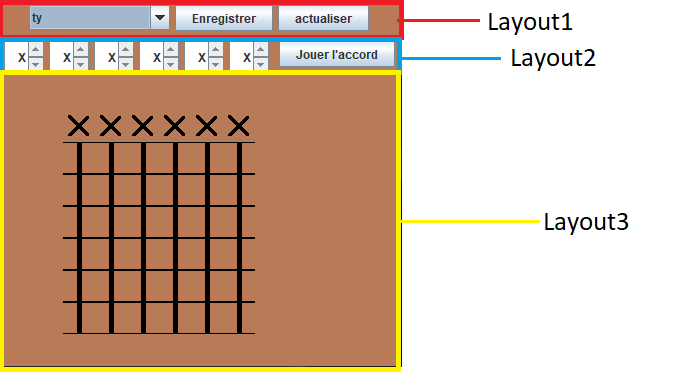
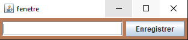
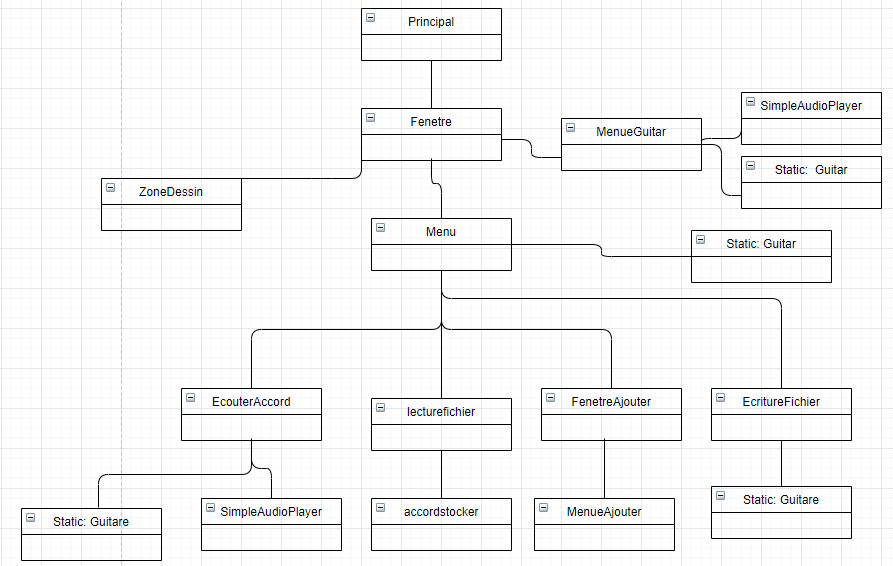

# Analyse.
## Classes utilisées et leur utilité

## Classe Principal
    public class Principal
Elle est la classe qui affichera la fenetre principal du logiciel.

## Classe Fenetre
    public class Fenetre extends JFrame
C'est la Fenetre principal qui assemble chaque partie dans une seul et meme fenetre grace a des layouts.

  

## Classe FenetreAjouter
    public class FenetreAjouter extends JFrame
Est une 2 ème Fenetre qui permet de créer sont propre accord.

  

## Classe Menu
    class Menu extends JPanel
Correspond à la layout 1 de la classe Fenetre. 
Elle s'occupe d'afficher une JComboBox et 2 Jbutton.La JComboBox affichera une ComboBox qui permetera d'afficher tout les accords disponibles dans le fichier texte et de pouvoir selectionner l'accord qu'on veut afficher.Et inversement si un accord est dessiner la ComBox affichera l'accord dessiner et affichera "N'existe pas" si l'accord n'est pas dans le fichier texte. 

Le bouton "Nouvelle accord" affichera une 2 ème fenetre de la classe FenetreCopie. 
Le bouton "actualiser" qui appelle la methode actualiser() de la classe lecturefichier. 

## Classe MenuAjouter
    class MenuAjouter extends JPanel
Est composé d'un JTextField qui permetera à l'utilisateur de rentrer le Nom de sont nouvelles accord. 
Il est composé aussi d'un bouton qui appelera la methode ecrire LectureFichierCopie avec comme paramètre le nom du nouvelles accord noté dans la JTextField qui ecrira le nouvelle accord dans le fichier texte. 

## Classe ecritureFichier
    class ecritureFichier
A une methode ecrire() qui ecrie dans le fichier texte les accords mit en static et le Nom mit en paramètre 

## Classe accordstocker
    class accordstocker
Est une classe qui stock la valeurs des accords et le nom de l'accord 

##Classe Guitare
	class Guitare
Une simple classe qui sert a avoir les valeurs des cordes dans tout le programme.

  Si une Corde vaut 100 alors cela correspond a un "X" (on ne joue pas la note).
  
  Si une Corde vaut 0 alors cela correspond a un Point en haut (la corde est gratté mais on ne la "presse" pas).
  
  Si une Corde vaut n alors cela correspond a un Point à la n-ième position en partant du haut de la guitare.

##Classe MenuGuitar
	class MenuGuitar extends JPanel implements ActionListener
Classe qui permet d'afficher les JSpinners et de les actualiser quand les notes de la classe Guitare change.

Les Jspinners sont instanciés avec des SpinnerCircularListModel. Ce qui permet que le JSpinner boucle lorsqu'on arrive à la fin de la liste.
Chaque JSpinner va stocker une liste de notes qui correspond au notes que l'on peut jouer avec la corde.

  Le Listener de chaque JSpinner vas changer la note correspondante de la Classe Guitare lorsque qu'il detecte un changement.

  La suite du programme vas juste vérifier via une série de switch l'état des cordes de la classe Guitare pour actualiser les JSpinner avec la bonne note.

##Classe SpinnerCircularListModel
	class SpinnerCircularListModel extends SpinnerListModel
Classe qui permet simplement de faire boucler les JSpinner lorsqu'on arrive a la fin.

  Pour s'en servir il faut instancier les JSpinners avec le constructeur :
  
  new SpinnerCircularListModel(Object[] items)
  

##Classe EcouterAccord
	Class EcouterAccord extends JPanel
Classe affiché sur le JBorderLayout.EAST qui permet d'écouter l'accord actuellement affiché lorsque l'on clique sur le bouton "jouer l'accord".
Elle génere du son grace à la classe SimpleAudioPlayer qui s'occupe de lire le fichier .WAV passé en paramètre.

  Pour savoir quel fichier WAV jouer, cette classe va regarder les notes de la classe Guitare puis génerer un String qui correspond au nom du fichier à jouer.
  
##Classe SimpleAudioPlayer
	class SimpleAudioPlayer
Classe qui vas lire le fichier de la varaible static "filename" lorque play() est appellé.

##Classe ZoneDessin
	class ZoneDessin extends JPanel implements MouseListener, ActionListener
Cette classe s'occupe d'afficher les sprites des cordes et des points de la guitare.
Elle va aussi implementer MouseListener pour savoir lorsque l'on clique sur un sprite, si on est dans la zone de la guitare alors il faut changer la note de cette corde par la note a l'endroit ou on a cliqué. (ModifieTableau(x,y,val))
A chaque fois qu'on redessine on nettoie toute la guitare avant pour qu'il n'y ai pas 2 points sur la meme corde.

##Relation entre les classes
