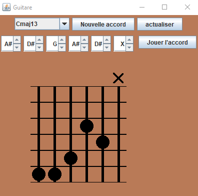

# Presentation.
## Ce qui fallait faire
Ce logiciel devra permettre de visualiser graphiquement des accords sur la représentation du manche d'une guitare. Les accords seront décrit dans un fichier texte, ce qui permettra par la suite de facilement étendre la bibliothèque d'accords du logiciel en rajoutant les nouveaux accords dans le fichier texte, sans avoir à modifier le programme.
L'utilisateur devra pouvoir rechercher le nom d'un accord en le spécifiant visuellement.Le logiciel devra aussi emmetre de la musique celon l'accord qui sera noté a l'ecran.

## Ce que le programme fait.
Avec le logiciel on peut visualisé des accord choisie.Il peut aussi reconnaitre des accords qui sera representer visualement avec l'interface. Le logiciel pourra aussi jouer l'accord qui sera presenté graphiquement.L'utilisateur pourra en bonus creer sont propre accord en lui donnant un nom. 
  