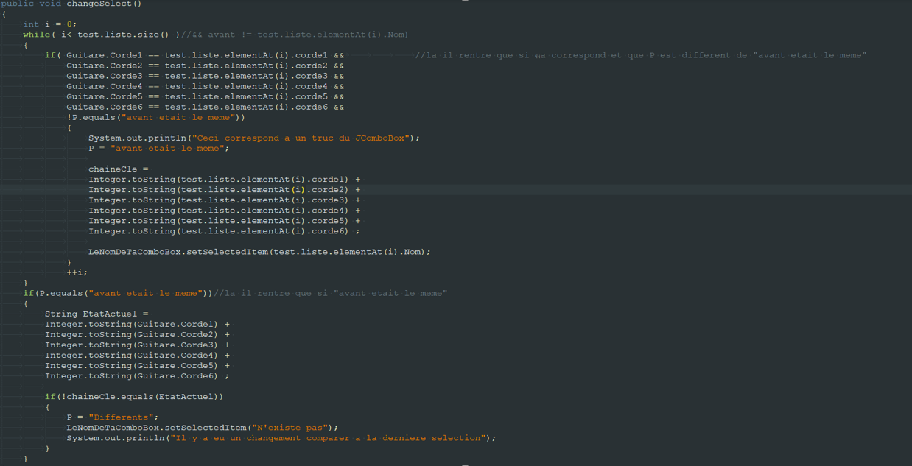

#Choix Techniques 
Choix techniques :
De manière générale les classes affichant des informations comme le nom de l’accord ou bien les notes de la guitare s’actualisent avec un Timer. Chaque fois que l’évènement du Timer est appelé alors les classes vont relire Guitare.java (qui stocke les notes des cordes actuelles avec des variables statiques) et les notes affichées vont être mis à jour.

Bien que très loin d’être optimale c’est malheureusement la seule solution que nous avons trouvée pour actualiser les notes.

#Présentation des algorithmes complexes utilisés

###Modification de l'affichage de la guitare.(ZoneDessin)
* Quand on clique on verifie si on est dans la zone des cordes de la guitare.
* On converti les coordonnées en pixel vers des coordonnées en "block" qui correspondent aux positions du tableau.
* On nettoie le tableau precedent en stockant la valeur de la corde à l'endroit cliqué
* Verification avec une serie de if/else if de tout les cas possibles.
* Lorsque l'on modifie le tableau on sauvegarde l'endroit que l'on a modifié.
* On actualise la classe Guitare avec la note nouvellement modifiée grâce a des switchs.
* On repaint() la classe ZoneDessin

Voir code ZoneDessin ::modifieTableau()

###Detection de l'accord actuellement affiché.(Menu2.changeSelect())
* A chaque fois que le timer est appellé, on vérifie si l'accord affiché correspond à un accord stocké et, si notre String nous dit que l'accord de la dernière verification était different de l'accord actuel.
* Si c'est le cas, on stocke une chaine qui correspond aux notes actuelles ainsi qu'un String qui permet de savoir si la dernière fois que l'on a vérifié, les notes étaient differentes de la chaine ou non.
* On change donc la valeur du JComboBox par le nom de l'accord si l'accord correspond et par "N'existe pas" si l'accord n'est pas recconu.

La raison pour laquelle nous vérifions si l'accord précedent est différent de l'accord actuel est pour éviter que le programme ne rechange la JComboBox si l'utilisateur ne touche à rien.
En effet les inputs de l'utilisateur pouvaient être "mangé" par le programme qui actualise la JComboBox résultant à une modification qui "s'annule".

  
#Format de fichier

Le fichier data.txt est composé du nom de l'accord, puis, sur la ligne d'après de la composition de celui-ci.

  0 -> note en haut de la corde
  
  1 -> note 1 de la corde
  
  ...
  
  6 -> note 6 de la corde
  
  7 -> On ne joue pas la corde

