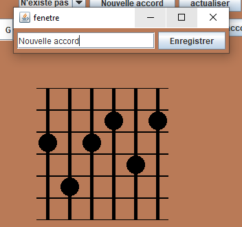

# Utilisation.
## Mode d'emploi
Lancer le logiciel. 
Une fenetre s'ouvre avec l'interface si dessous 
  

Si vous voulez afficher un accord selectionner la JcomboBox (La case a coter du bouton "Nouvelle accord") puis selectionner l'accord que vous voulez afficher 
  
ET LA MAGIE L'ACCORD S'AFFICHE 
  
Si vous cliquer sur la partie graphique du manche de guitard vous pouvez selectionner une corde precise ou même les placer avec les Jspiner.  

Manche de Guitard :  
  

Jspiner :  
  
Le symbole de la croix représente qu'on ne gratte pas la corde. 
  
Le point représente que l'ont gratte la corde en appuyant sur un endroit precis de la corde. 
  
Si le point est tout en haut du manche cela symbolise que l'ont gratte la corde mais qu'on appuie pas dessus 
  

Quand vous avez desinner un accord soit avec les Jspinners soit avec le manche de guitard le nom de l'accord sera afficher sur la comboBox. 
Vous pouvez écouté l'accord dessiner avec le bouton "Jouer l'accord" 

  

Il est possible aussi de creer sont propre accord en appuyant sur le bouton "Nouvelle accord" 

  

Ce bouton va afficher une nouvelle fenetre ou rentrer le nom de votre nouvelle accord et creer votre accord à partir du manche de la premiere fenetre.Appuyer sur le bouton "Enregistrer" pour enregistrer votre accord. 

  

Appuyer ensuite sur le bouton actualisé et vous pouvez afficher l'accord que vous avez créer. BRAVO. 

  

# Configuration requise
Avoir une machine virtuelle java.